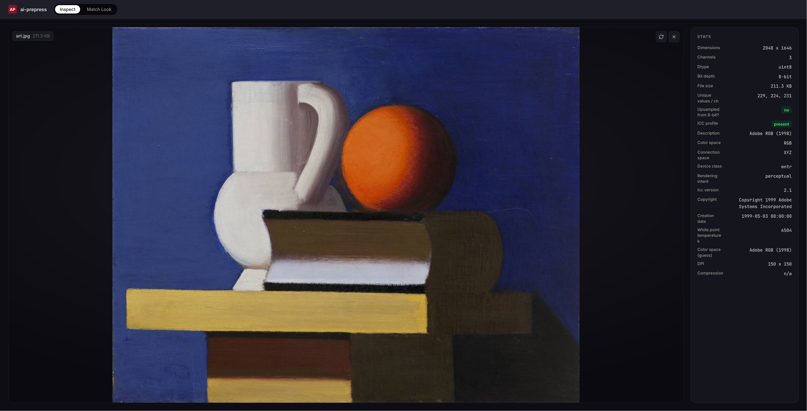

# ai-prepress

A standalone tool for the print/retouching side of an AI image pipeline: color matching, masking, cropping, face retouching, dust removal, background replacement. Built after a production incident where files kept reaching retouching with inconsistent profiles and colors drifting warmer across repeated regenerations of the same image ("dérives chromatiques").



Early stage. What's here right now: a shared image I/O layer, an acceptance-check utility, an image inspector (real dimensions, bit depth, ICC profile, EXIF, raw tags), Match Look (the first of seven planned Capture One-parity features), a local FastAPI service, and a dark-themed HTML/JS front end. Masking, AI crop, face retouch, dust removal, background replacement and snap-to-eye aren't built yet.

## How it works

Two pieces everything else builds on:

- **I/O** (`ai_prepress/io.py`) loads and saves images without touching bit depth or dropping the ICC profile. Every feature routes through this instead of writing its own load/save path. It exists because a common failure mode - silently dropping the ICC profile and clamping to 8-bit right at the point pixel data crosses a plain numpy array (`Image.fromarray()` returns a fresh object with an empty `.info`) - is exactly the bug that caused the incident above. Checked directly, not assumed: round-tripping a 16-bit wide-gamut TIFF through Pillow's own array path collapses it; going through `tifffile` with the profile written as an explicit extratag does not. TIFF is the only format that keeps full bit depth here; PNG/JPEG/WebP are accepted too but are 8-bit only (WebP is written lossless - Pillow defaults it to lossy, and unlike JPEG it has a real lossless mode, so there's no reason to take the lossy path).
- **Acceptance checks** (`ai_prepress/checks.py`) run on a before/after pair and report Delta-E 2000 drift, a bit-depth sanity check (count of unique pixel values per channel - 256 or fewer on a file that's supposed to be 16-bit means something clamped it upstream), and whether the ICC profile survived. The Delta-E math goes through `colour-science`'s own RGB→XYZ→Lab conversion in full float rather than Pillow's ICC transform, specifically because Pillow can't hold 16-bit RGB - routing through it would quantize to 8-bit before measuring, making the check blind to exactly the sub-8-bit drift it exists to catch.

## Inspect

Drop an image in and get the real picture before running anything on it: dimensions, dtype, bit depth, file size, per-channel unique-value counts (and a flag if a file claiming to be 16-bit only actually has ≤256 distinct values per channel - a common sign something upstream already collapsed it to 8-bit), DPI, TIFF compression, and EXIF.

For color, two separate things are shown, not one:
- **The real embedded ICC profile**, read directly off the file when there is one - description, color space, connection space, device class, rendering intent, ICC version, copyright, creation date, white point temperature. All of this comes straight from the profile's own header, nothing inferred.
- **A colour-space guess** (`sRGB` or `Adobe RGB (1998)`), shown alongside it. This is a heuristic - a substring match on the profile's description, falling back to `sRGB` if there's no profile or nothing matches - and it's what Match Look's math actually buckets colors into internally (see the note below). It stays visible even when the real profile is known, since it isn't always the same thing and Match Look's own assumption is worth seeing plainly.

TIFF files also get a full raw tag dump (every tag on the page, the ICC profile's own bytes excluded since they're already shown properly above) for whenever the curated fields aren't enough.

## Match Look

First real feature, built first on purpose: no model, no GPU, plain numpy. Applies one reference image's color statistics to a target - MKL (matches full covariance) or Reinhard (matches per-channel mean/std in a log-LMS space). Reimplemented directly rather than depending on the `color-matcher` package: it's GPL-3.0, this repo is MIT, and its own example code clamps output to 8-bit before saving anyway, which is the thing this whole project exists to stop doing. The math itself (Reinhard et al. 2001, Monge-Kantorovich linearization) is published and unencumbered.

One function covers two workflows: point it at a flat, neutral reference before retouching to normalize a batch without baking in a look, or at a graded reference after retouching for delivery consistency.

> [!NOTE]
> The color-transfer math itself works in one of two named spaces (sRGB or Adobe RGB (1998)), decided by the same heuristic guess Inspect shows - a substring match on the profile description, not a real ICC parser. Covers the two spaces actually in use here, nothing more general yet.

## Installation

```bash
uv sync
```

Needs Python 3.12 - pinned deliberately rather than using whatever's newest on the machine, since some of the model-facing dependencies landing once masking gets built are unlikely to have wheels for a Python release that's still this new.

## Usage

Run the API and UI:

```bash
uv run uvicorn ai_prepress.api.main:app --reload
```

Open `http://127.0.0.1:8000` - it opens straight into Inspect. Drag an image onto the drop zone (or click to browse; TIFF, PNG, JPEG, WebP) and it fills in place with a preview, a filename/size chip, and replace/remove controls - the same import control is reused wherever the app needs an image in, including both slots in Match Look. Previews shown in the browser are downsized (1024px on the long edge) and JPEG-encoded before being sent over - on a 48-megapixel 16-bit TIFF that cut preview generation from a few seconds and a 129MB PNG down to well under 50ms and a few hundred KB. The stored result itself, reachable from the download link, keeps full bit depth and resolution.

The dark theme (`tokens.css`, `components.css`) is dropped in as-is from an internal design handoff (POP R&D), per that handoff's own instructions for a CSS-based stack - not modified, just wired up.

Or call the core directly:

```python
from ai_prepress.io import load, save
from ai_prepress.features.match_look import match_look

target = load("target.tiff")
reference = load("reference.tiff")
result = match_look(target, reference, method="mkl")
save(result, "output.tiff")
```

Ran it on a synthetic 6000x4000 16-bit file to get a real number instead of guessing: about 6 seconds for MKL, CPU only, on an M-series Mac.

Or read a file's real metadata without touching pixels:

```python
from ai_prepress.metadata import describe

info = describe("scan.tiff")
info.icc_profile       # real fields read from the embedded profile, {} if there isn't one
info.colourspace_guess  # the sRGB / Adobe RGB (1998) bucket Match Look's math uses internally
```

## Roadmap

- [x] Shared I/O + acceptance checks
- [x] Image inspection (dimensions, bit depth, real ICC profile + guess, EXIF, raw tags)
- [x] Match Look
- [ ] pywebview desktop shell around the current FastAPI + HTML UI
- [ ] Shared segmentation backend (SAM3 + BiRefNet), feeds masking, AI crop, and background cutout
- [ ] AI Crop
- [ ] Retouch Faces
- [ ] Dust Removal (needs a synthetic training set built first)
- [ ] Background Replacement
- [ ] Snap to Eye - blocked on a scope call, Capture One's actual feature is a coarse focus-check aid, not a precision alignment tool, and it's not clear yet which one is wanted here

Standalone desktop tool, not a Photoshop plugin, but the core is a plain package behind a local HTTP API specifically so a plugin (or a local-inference mode, later) can become just another client instead of a rewrite. Every model-tier step for now calls out to RunPod/Modal rather than running locally - compute isn't the constraint here, keeping v1 simple is.
