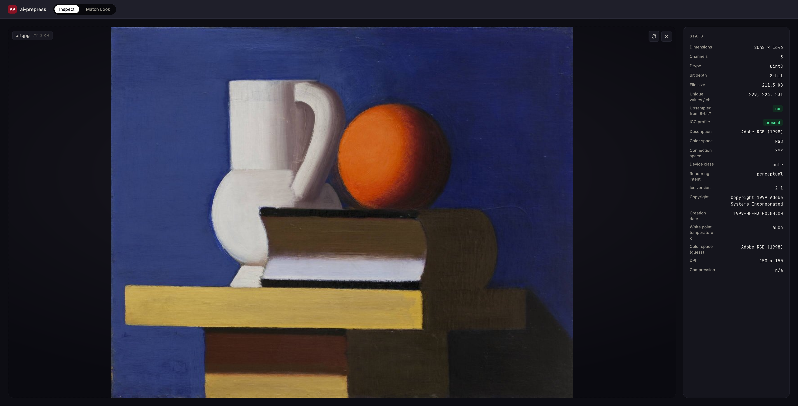

# ai-prepress

A standalone tool for the print/retouching side of an AI image pipeline: color matching, masking, cropping, face retouching, dust removal, background replacement. Built after a production incident where files kept reaching retouching with inconsistent profiles and colors drifting warmer across repeated regenerations of the same image ("dérives chromatiques").



Early stage. What's here right now: a shared image I/O layer, an acceptance-check utility, an image inspector (real dimensions, bit depth, ICC profile, EXIF, raw tags), Match Look, Face Regions + Retouch Faces (Dark Circles/Even Skin/Contouring, running locally via MediaPipe landmarks), a local FastAPI service, and a dark-themed HTML/JS front end. Masking, AI crop, Blemish removal, dust removal, background replacement and snap-to-eye aren't built yet.

## How it works

Two pieces everything else builds on:

- **I/O** (`ai_prepress/io.py`) loads and saves images without touching bit depth or dropping the ICC profile. Every feature routes through this instead of writing its own load/save path. It exists because a common failure mode - silently dropping the ICC profile and clamping to 8-bit right at the point pixel data crosses a plain numpy array (`Image.fromarray()` returns a fresh object with an empty `.info`) - is exactly the bug that caused the incident above. Checked directly, not assumed: round-tripping a 16-bit wide-gamut TIFF through Pillow's own array path collapses it; going through `tifffile` with the profile written as an explicit extratag does not. TIFF is the only format that keeps full bit depth here; PNG/JPEG/WebP are accepted too but are 8-bit only (WebP is written lossless - Pillow defaults it to lossy, and unlike JPEG it has a real lossless mode, so there's no reason to take the lossy path).
- **Acceptance checks** (`ai_prepress/checks.py`) run on a before/after pair and report Delta-E 2000 drift, a bit-depth sanity check (count of unique pixel values per channel - 256 or fewer on a file that's supposed to be 16-bit means something clamped it upstream), and whether the ICC profile survived. The Delta-E math goes through `colour-science`'s own RGB→XYZ→Lab conversion in full float rather than Pillow's ICC transform, specifically because Pillow can't hold 16-bit RGB - routing through it would quantize to 8-bit before measuring, making the check blind to exactly the sub-8-bit drift it exists to catch.

## Inspect

Drop an image in and get the real picture before running anything on it: dimensions, dtype, bit depth, file size, per-channel unique-value counts (and a flag if a file claiming to be 16-bit only actually has ≤256 distinct values per channel - a common sign something upstream already collapsed it to 8-bit), DPI, TIFF compression, and EXIF.

For color, two separate things are shown, not one:
- **The real embedded ICC profile**, read directly off the file when there is one - description, color space, connection space, device class, rendering intent, ICC version, copyright, creation date, white point temperature. All of this comes straight from the profile's own header, nothing inferred.
- **A colour-space guess** (`sRGB` or `Adobe RGB (1998)`), shown alongside it. This is a heuristic - a substring match on the profile's description, falling back to `sRGB` if there's no profile or nothing matches - and it's what Match Look's math actually buckets colors into internally (see the note below). It stays visible even when the real profile is known, since it isn't always the same thing and Match Look's own assumption is worth seeing plainly.

TIFF files also get a full raw tag dump (every tag on the page, the ICC profile's own bytes excluded since they're already shown properly above) for whenever the curated fields aren't enough.

## Match Look

First real feature, built first on purpose: no model, no GPU, plain numpy. Applies one reference image's color statistics to a target - MKL (matches full covariance) or Reinhard (matches per-channel mean/std in a log-LMS space). Reimplemented directly rather than depending on the `color-matcher` package: it's GPL-3.0, this repo is MIT, and its own example code clamps output to 8-bit before saving anyway, which is the thing this whole project exists to stop doing. The math itself (Reinhard et al. 2001, Monge-Kantorovich linearization) is published and unencumbered.

One function covers two workflows: point it at a flat, neutral reference before retouching to normalize a batch without baking in a look, or at a graded reference after retouching for delivery consistency.

> [!NOTE]
> The color-transfer math itself works in one of two named spaces (sRGB or Adobe RGB (1998)), decided by the same heuristic guess Inspect shows - a substring match on the profile description, not a real ICC parser. Covers the two spaces actually in use here, nothing more general yet.

## Training data (dust removal)

Dust removal needs a fine-tuned detector before anything else, and that needs a dataset before the fine-tuning does - so this came first, on its own, ahead of the feature itself.

`training/dust_removal/synthesize.py` takes a directory of clean (dust-free) images and adds synthetic sensor-dust spots, writing the augmented images plus a COCO-style `annotations.json` next to them:

```bash
uv run python -m training.dust_removal.synthesize path/to/clean_images/ path/to/output/
```

Dust is modeled as multiplicative attenuation in linear light (soft-edged, semi-transparent, roughly circular) rather than painted onto the gamma-encoded pixels directly - matches how DxO describes building their own detector's training data, and it's the only way the falloff shape comes out right. Goes through the same `cctf_decoding`/`cctf_encoding` pair Match Look uses, not a hardcoded sRGB gamma.

No RF-DETR fine-tuning yet, and no real "clean" source photos lined up to run this against at scale - both still open.

## Installation

```bash
uv sync
```

Needs Python 3.12 - pinned deliberately rather than using whatever's newest on the machine, since some of the model-facing dependencies landing once masking gets built are unlikely to have wheels for a Python release that's still this new.

## Usage

Run the API and UI - every feature except Layer Separation runs locally with no environment variables needed. Layer Separation calls a remote Modal-hosted model (`deploy/layer_separation.py`) and needs `AI_PREPRESS_LAYER_SEPARATION_URL` set to that deployment's base URL - see the Layer Separation section below:

```bash
uv run uvicorn ai_prepress.api.main:app --reload
```

Open `http://127.0.0.1:8000` - it opens straight into Inspect. Drag an image onto the drop zone (or click to browse; TIFF, PNG, JPEG, WebP) and it fills in place with a preview, a filename/size chip, and replace/remove controls - the same import control is reused wherever the app needs an image in, including both slots in Match Look. Previews shown in the browser are downsized (1024px on the long edge) and JPEG-encoded before being sent over - on a 48-megapixel 16-bit TIFF that cut preview generation from a few seconds and a 129MB PNG down to well under 50ms and a few hundred KB. The stored result itself, reachable from the download link, keeps full bit depth and resolution.

The dark theme (`tokens.css`, `components.css`) is dropped in as-is from an internal design handoff (POP R&D), per that handoff's own instructions for a CSS-based stack - not modified, just wired up.

Or call the core directly:

```python
from ai_prepress.io import load, save
from ai_prepress.features.match_look import match_look

target = load("target.tiff")
reference = load("reference.tiff")
result = match_look(target, reference, method="mkl")
save(result, "output.tiff")
```

Ran it on a synthetic 6000x4000 16-bit file to get a real number instead of guessing: about 6 seconds for MKL, CPU only, on an M-series Mac.

Or read a file's real metadata without touching pixels:

```python
from ai_prepress.metadata import describe

info = describe("scan.tiff")
info.icc_profile       # real fields read from the embedded profile, {} if there isn't one
info.colourspace_guess  # the sRGB / Adobe RGB (1998) bucket Match Look's math uses internally
```

## Face regions (local, MediaPipe landmarks)

Region detection for Retouch Faces (under-eye, cheek, forehead, skin) runs locally via `ai_prepress.face_landmarks` - no Modal deployment, no GPU, MediaPipe's own CPU path is fast enough on a single image.

This replaced an earlier version built on `jonathandinu/face-parsing` (SegFormer-B5 fine-tuned on CelebAMask-HQ), deployed to Modal and non-commercial-licensed. That approach got the plumbing proven but turned out to be the wrong foundation: CelebAMask-HQ's 19-class taxonomy has no under-eye, cheek, or forehead class, and Retouch Faces' actual sub-tools (Dark Circles, Contouring) need exactly those regions - no amount of model quality fixes a class that doesn't exist in the training data. MediaPipe's 478-point face mesh defines these regions as geometry instead, and is Apache 2.0.

```python
from ai_prepress.io import load
from ai_prepress.face_landmarks import detect_landmarks, under_eye_band, skin_region

image = load("portrait.tiff")
landmarks = detect_landmarks(image.array)  # None if no face found
right_under_eye = under_eye_band(landmarks, "right")  # polygon, (x, y) pixel coords
skin_oval, cutouts = skin_region(landmarks)  # face oval + eye/lip cutouts to subtract from it
```

Region index groups (`FACE_OVAL`, eye/lip loops, eyebrows) are walked from mediapipe's own `face_mesh_connections.py` edge lists, not guessed - see the module's docstring for sourcing and for which regions are geometrically precise (eyes, lips) versus approximate (cheek, forehead - no natural landmark boundary exists for those the way an eyelid margin does for the eye).

**Face Regions tab in the UI**: upload a portrait, hit Find regions. Coordinates come back already scaled to match the preview image, so the browser draws each region as a canvas path directly - no per-pixel compositing needed the way the old label-map viewer required. Checkbox legend toggles regions, hover pops one region and dims the rest.

## Retouch Faces

The masks above feeding into an actual edit: `ai_prepress.features.retouch_faces` does classical frequency separation - split the image into a low-frequency (LF, tone/shading) layer and a high-frequency (HF, texture/pores) layer, edit LF only inside a region mask, recombine with the HF layer. HF stays untouched for Dark Circles and Contouring (what makes "waxy skin" impossible by construction, not something hoped for from a generative model); Even Skin's Texture control is a deliberate exception - see below. Blemish removal isn't here - it needs actual inpainting, a different kind of model this project doesn't have wired up yet. Built against a research pass across Capture One's own documentation, Retouch4me, Lightroom Classic's masking architecture, and the manual Photoshop frequency-separation workflow professional retouchers already use - see the "face-parsing-vs-landmarks-pivot" project note for the full findings.

```python
from ai_prepress.io import load
from ai_prepress.features.retouch_faces import retouch_faces, RetouchStrengths

image = load("portrait.tiff")
result = retouch_faces(image, RetouchStrengths(dark_circles=0.5, even_skin=0.4, contouring=0.3))
# None if no face detected. A plain RetouchStrengths applies to every detected face; pass
# {0: RetouchStrengths(...), 1: RetouchStrengths(...)} for independent per-face control.
```

**Controls**, confirmed against Capture One's own Skin Tools panel rather than guessed:
- **Dark circles / Even skin / Contouring** - 0-1 strength, as before.
- **Even skin - Texture** (`even_skin_texture`, -1..1) - Capture One's Even Skin panel has both Amount and a separate signed Texture slider; negative pushes extra flattening beyond Amount alone (their own example, "80 Amount / -70 Texture", is described as an editorial-polish look), positive mildly restores detail. This scales the HF layer within the even_skin mask specifically - the one place HF is ever touched.
- **Mask feather / edge** (`feather_amount`, `edge_amount`) - Lightroom Classic's own mask "Reshape" step (Feather + Edge) is the cheap fix for "the AI-derived region is a bit off" before a full paint brush, which this project doesn't have yet. `edge_amount` erodes (negative) or dilates (positive) a region's boundary via an exact separable min/max filter, capped at half an eye-width so an extreme value shrinks a region without a one-click "mask disappeared" trap.
- **Eye whiten / Teeth whiten / Lip enhance** (`eye_whiten`, `teeth_whiten`, `lip_enhance`, 0-1) - direct HSL color grades, not frequency separation (there's no texture to preserve the way skin smoothing needs to). Sourced from a research pass across professional retouching tutorials (PhotoshopCafe, Fstoppers, Retouching Academy, Lightroom/Kelby, Photoshop Essentials, PortraitPro/ON1/Aperty), not guessed: eye whitening is a small color-cast correction plus a highlight-rolloff-capped lightness lift, never a flat brighten - "milk eyes"/"alien eyes" from over-brightening is the single most-documented failure mode, not a blown-out catchlight (which is already protected structurally, since the sclera mask excludes the iris). Teeth whitening restricts the mouth-interior mask to actual tooth-colored pixels first (a lightness threshold, not the raw polygon - every source treats gum/gap exclusion as a masking problem, not a color-math one), then desaturates yellow by 60-80% and lifts lightness modestly. Lip enhance boosts the person's own lip color rather than recoloring it (the confirmed default for commercial/portrait tools, versus beauty apps which default to a color swatch) - lightness is left untouched entirely, only chroma is scaled up, gated back to no boost near the lip's own highlight range so the color step doesn't flatten the specular.
- **Multi-face** - every competitor researched treats this as core. `detect_landmarks(rgb, max_faces=N)` returns every detected face, sorted left-to-right for stable indexing.

No scipy, and PIL's `GaussianBlur` flatly refuses float-mode images (confirmed by hand, not assumed) - routing 16-bit data through it would mean quantizing to 8-bit first, so the LF/HF split runs on a from-scratch separable box-blur approximation operating directly on the same float64 arrays the rest of the pipeline uses. Mask edges are feathered (a hard polygon edge on a brightened region looks like a sticker) using the same blur; erode/dilate uses a separate exact min/max filter (a rectangle is the Minkowski sum of a horizontal and vertical segment, so one pass per axis is exact, not an approximation).

**Retouch Faces tab in the UI**: upload a portrait - every detected face is listed (with a cropped thumbnail) alongside an "All faces" row. Select a row to edit that face's (or everyone's) sliders independently; once any individual face is customized, "All faces" greys out rather than silently dropping whatever was set there, since the API sends either one broadcast strengths object or an explicit per-face map, never both at once. Shows original next to retouched side by side (same before/after pattern as Match Look), plus the same acceptance-check stats (Delta-E, bit depth, ICC profile) Match Look surfaces, and a full-precision TIFF download.

## Layer Separation

Input one photo, get every distinct object/subject back as its own RGBA layer plus a reconstructed background plate for whatever was behind them - Phase 1 of the segmentation/layer-separation suite. Model: [Qwen-Image-Layered](https://huggingface.co/Qwen/Qwen-Image-Layered) (Apache 2.0, confirmed on its own model card), a diffusion model that decomposes a photo into N RGBA layers in one pass. It's heavy and GPU-only, so it runs behind Modal (`deploy/layer_separation.py`), not locally - the first feature in this project that isn't CPU-fast enough to run in-process.

Modal web endpoints cap any single HTTP request at 150 seconds, and a cold-started multi-layer diffusion call can run well past that. Rather than build this codebase's first job-polling UI, the Modal side exposes two fast endpoints (`submit` spawns the work and returns instantly, `result` is a cheap non-blocking check) wrapping one long-running internal call, and `ai_prepress.layer_decompose` hides the spawn-and-poll loop behind a single ordinary blocking function - `features/`, the API, and the UI all see one plain call, same shape as every other remote model in this project, just a slower one.

```python
from ai_prepress.io import load
from ai_prepress.features.layer_separation import separate_layers

image = load("photo.tiff")
result = separate_layers(image)  # needs AI_PREPRESS_LAYER_SEPARATION_URL set
result.background  # LoadedImage, RGB, 8-bit - genuinely model-generated, no higher-precision source exists
result.layers       # list[SeparatedLayer], each an RGBA LoadedImage matching the source's own bit depth
```

**Bit-depth handling** is the one piece of real logic here, and it's the reason this isn't just "save whatever the model returns": the remote model's own RGB output is 8-bit diffusion-model output, which would be a silent regression in a project whose whole identity is never collapsing bit depth. So only the model's *alpha channel* is kept per layer - it gets recombined with the ORIGINAL image's own full-precision RGB, since a higher-fidelity source already exists for every non-occluded layer pixel. Only the background plate is genuinely novel content (reconstructed pixels with no source data behind them), so it's the one explicit, documented 8-bit exception.

**Export** is RGBA TIFF via `ai_prepress.io` - straight (unassociated) alpha, not premultiplied, matching PNG's own convention and avoiding the fringing bugs that come from mixing the two. `psdtags` (TIFF-embedded Photoshop proprietary tags) is a promising path toward layers a retoucher can open natively in Photoshop, but its real-Photoshop round-trip hasn't been tested, so it's not built on top of an unverified assumption.

**Layer count is computed per photo, not hardcoded.** `ai_prepress.object_count` runs SAM2 (Apache 2.0, verified from its own LICENSE file - SAM3 was checked first and rejected for a custom restricted-use license) in automatic "segment everything, no prompt" mode before the main decomposition, and `features.layer_separation` maps the survivor count to `layers = clamp(count + 1, 2, 8)`. Real calibration problem, not a solved one: SAM2's automatic mode doesn't distinguish a discrete object from any locally coherent texture patch - a photo of one person came back `object_count=67` at the library's default sampling density (grass, a background crowd, and building details all counted), a 4-object still life came back 17. Cutting `points_per_side` from 32 to 8 brought those down to 3 and 8 respectively - genuinely differentiated, but still a first-cut tuning, not a calibrated "real object" count. A later pass added explicit post-filtering of SAM2's raw mask list rather than tuning sampling density further: `drop_background_masks` removes a candidate that touches two or more image edges and covers more than 45% of the frame (sky/grass/wall/table read as one object otherwise), and `dedupe_overlapping_masks` merges candidates that are almost certainly the same real object at two granularities - a whole object and a sub-region of it, both sampled by different grid points - measured on pixel containment/IoU of the actual boolean mask arrays (>=0.9), deliberately not on bounding boxes, since two adjacent unrelated objects (an orange sitting in front of a table) routinely have one bbox fully inside the other while their real masks barely overlap. `MIN_LAYERS`/`MAX_LAYERS` clamping is still what actually keeps the downstream request sane regardless of how well this tunes further. `ai_prepress.object_count` failing for any reason falls back to a fixed default rather than failing the whole request - an enhancement over a working fallback, never a hard dependency.

**Naming is automatic too**, a fast follow to the manual rename field rather than the blocker it was originally scoped as: `ai_prepress.layer_naming` (InternVL3.5-2B, Apache 2.0) labels every layer of a photo after decomposition, and the UI's rename field comes pre-filled with the suggestion (still fully editable). Two real integration details found by deploying, not anticipated: the model's own reference preprocessing does `.convert('RGB')` and never sees an alpha channel, so the client flattens each RGBA layer onto white before sending it; and the first prompt ("name the object") made the model transcribe a sticker's own printed text verbatim instead of describing what kind of object it was, fixed with an explicit "not any text or logo visible on it" clause. Naming failing for any reason falls back to the existing generic "Layer N" label, same non-hard-dependency treatment as layer counting.

Naming was originally one batched call across every layer of a photo. That batching blew GPU memory (a real `torch.OutOfMemoryError` on the deployed T4, confirmed in Modal's own container logs) on any photo with more than roughly two sizeable layers - every `suggested_name` on a 6-layer real photo came back `None`, not a timeout. Fixed by naming one layer at a time via the model card's own documented `model.chat()` call instead of `model.batch_chat()`. That fix has its own cost: sequential per-image naming measured at ~77s for 6 real layers, which silently blew past the client's old 60s default timeout and produced the same all-`None` result for a different reason even after the OOM fix. The client timeout is now 300s.

**Layer Separation tab in the UI**: upload a photo, hit Separate layers (this can take a few minutes on a cold Modal start, and the status line says so). A real Photoshop-style layers panel, not a static result page - a canvas composites every visible row (Original, Background, Layer 1..N, stacked bottom to top matching the model's own layer_index convention) live, each row has an eye toggle, clicking a thumbnail solos that row, "Show all" recovers the full composite, and each layer shows its `alpha_coverage` as a small badge. Sidebar lists topmost-first (Photoshop convention), a reversal of the canvas's own draw order rather than a second ordering to keep in sync. Rename fields and per-layer downloads work as before, plus a "Download all" zip. First shipped as a static background-plus-tiny-icons list; rebuilt into this after the user's own test screenshot called it "not useable at all" - see the `layer-separation-results-ux` project note for the design reasoning.

**Deployed and tested against a real Modal account and a real photo** (a multi-object still life - pitcher, orange, book, table): ~430s on a cold start, ~125s once the container's warm (`scaledown_window=600` keeps it warm for 10 minutes between calls). A100-80GB handled the model without incident. `layers=4` (the default) produced a clean, correctly-isolated pitcher layer, an orange+table layer the model grouped together rather than splitting further, and a third layer picking out a table-edge stripe - genuinely usable object-level separation, not noise, though coarser than one-layer-per-visible-object.

Background reconstruction quality turned out to be case-dependent, tested on two structurally different real photos. The still life (flat color blocks, hard geometric edges, objects with almost no texture) kept faint ghosted outlines of the removed pitcher and orange, and painted the whole lower half - where a table surface was - as flat wall color instead of a plausible table. A second test, an ordinary natural photo (a person seated on a chair on grass, buildings in the background), reconstructed the grass/sky/buildings/shadow with no visible ghosting at all, and separated a tiny corner watermark sticker, the chair (correctly punching through its open backrest slats as negative space), and the person as three distinct alpha silhouettes. Natural photography - the primary real use case for this tool - is where the model actually performs well on background reconstruction; flat/graphic source images with hard color-block edges are the harder case.

**Correction, found later the same session: a clean alpha silhouette does not mean clean layer content.** compositing the "chair" layer's actual RGB content onto a checkerboard, not just reading its alpha channel as a white shape, showed the mask shape is correct but the pixel content within it is heavily mixed with the person's clothing wherever the person occludes the chair - confirmed independently by `layer_naming`, unprompted, landing on "Jeans" for both the "chair" and "person" layers when asked what each one is. Always verify actual RGB content on a checkerboard before calling a separation clean; the alpha mask alone isn't evidence. The background-fill fallback (LaMa/BrushNet/PowerPaint) stays deferred rather than scheduled - it would only fix a case that isn't the common one.

Three real deployment issues surfaced that no amount of reading docs would have caught, all fixed and now part of the shipped code: the build image needed `git` and `torchvision` neither of which the model's own install instructions mention; two separate `@modal.fastapi_endpoint` functions each got their own subdomain instead of sharing a base URL (now one `@modal.asgi_app()` with two routes); and calling a sibling class's method from within another function of the same app needs an explicit `modal.Cls.from_name(...)` lookup plus a `@modal.method()` decorator on the target - direct in-module instantiation silently isn't remote-callable there. Also found and fixed: the model's real alpha output carries widespread low-level noise across nearly the whole frame, not clean binary values, which blew every layer's bounding box out to near-full-image before a majority-opacity threshold fixed it.

**Automatic layer count does not fix the still life's separation quality - confirmed, not assumed, and re-confirmed with a corrected mechanism.** The original motivation for computing `layers` automatically was the still-life test above: the orange and table came out merged into one layer at the fixed `layers=4` default, and the hope was that requesting more layers would split them. An earlier same-seed test reported that `requested_layers=8` returned the exact same 3 layers, bounding boxes and content included, as `requested_layers=4` - implying the model was silently ignoring the parameter. A later, more careful same-seed A/B (`layers=4` vs `layers=8` on the same photo) contradicts that: the two runs produce genuinely different output (different content hashes, 3 layers vs 7 layers) - the `layers` parameter does reach the model and does change what it produces, this is not a dropped-kwarg bug. But the extra capacity doesn't reliably manifest as finer real separation: 2 of the 7 layers in the `layers=8` run came back at exactly 0.0 alpha coverage - literally empty, contributing nothing - so part of what "more layers" buys is empty junk layers rather than a genuinely split orange and table. Net result unchanged from the original finding even though the mechanism explanation was wrong: **the orange+table merge is not fixed by requesting more layers**, on this photo, either as originally measured or as re-measured here.

**Contamination validator + recursive repair - a real true-positive catch, but it does not fix the merge case it targets.** `features.layer_separation` runs a contamination check after naming: any pair of layers whose color histograms come back suspiciously similar (`cv2.HISTCMP_CORREL >= 0.9`) is flagged with `contamination_flag: true` on both layers, now surfaced directly in the `/api/layer-separation` response. A flagged layer is eligible for one recursive repair attempt (`MAX_REPAIR_ATTEMPTS=2` per request): the layer's crop is resubmitted to the model for a fresh, finer decomposition, and the result only replaces the original if it produces at least `MIN_REPAIR_SUBLAYERS=2` genuinely usable sub-layers - anything less falls back to the original layer with no data loss. On a live re-run of the still-life photo (`layers=7`, `final_layer_count=6`), the validator correctly caught two real duplicate pairs - two separate layers both independently named "apple" (histogram similarity 0.992) and two both named "book" (0.996), both visually confirmed as the same object duplicated across adjacent output layers, while every other adjacent pair scored <=0.65 and went unflagged. That's a genuine true-positive catch, not a false-positive spray. But repair did not help on this photo: inspecting the repair call directly, resubmitting the orange's crop got back one full-coverage alpha and one entirely empty one, correctly judged not a real split (below `MIN_REPAIR_SUBLAYERS`) and discarded in favor of the original. The repair strategy (re-decompose a crop to split occluded content) doesn't match this photo's actual contamination type, which is the model duplicating one already-isolated object across two output layers - there's nothing left in that crop to split out. One more caveat before building UI around the field: `MAX_REPAIR_ATTEMPTS=2` means `contamination_flag: true` can mean either "flagged" or "flagged and a repair was attempted," not always the same thing.

**Guided-filter alpha refinement was built, measured against real hair edges, and shipped disabled.** The idea was to sharpen the model's own soft alpha against the source RGB as a guide image. Measured on a real hair edge in a natural portrait photo at full source resolution: the unrefined, coarse alpha the model actually returns has a 10%-90% transition width with median 13-15px across repeated runs (a genuinely soft matte, not hair-sharp, but a known, stable baseline). A 45-combination sweep of the refinement's own parameters (radius 2-64, epsilon 1e-4-1e-1, plus a trimap-style band limiting refinement to a narrow region around the coarse edge) never once improved that measured width, and the module's shipped defaults made it far worse under the same metric - 14px unrefined widened to 72px refined. Row-level inspection of the guide image explains why: real hair texture in the source RGB reads as edge signal throughout what should be a flat, opaque interior, not only at the true boundary, so the metric may be partly measuring interior texture noise rather than a genuinely wider edge - but no parameter setting both changed the alpha meaningfully and survived the measurement, so there was nothing left to justify shipping refinement on. The call is disabled in `_composite_layer`; every layer ships the model's coarse alpha unmodified. `alpha_refine.py` itself is kept in the repo with an accurate docstring, and a test locks "refinement is off" so it can't be silently re-enabled without a test failing.

**Working resolution bucket (640, not 1024) is a measured decision, not the model card's own recommendation.** Same seed, same two test photos, only `RESOLUTION_BUCKET` changed: 1024 did not produce a cleaner separation on the still life (still 3 layers, but one came back at exactly 0.0 alpha coverage, a wasted layer rather than a finer split) and coverage on the other two shifted rather than improved. Every layer gets resized back to source resolution regardless of working bucket, so a narrower bucket mechanically narrows the raw output ramp width by roughly 0.625x with zero real quality change - measured raw ramp width at 1024 came out to ~0.64-0.75x of 640's on both test photos, at or above that mechanical floor, so there's no evidence 1024 resolves the alpha edge any more finely once the resampling arithmetic is accounted for. 1024 also cost real latency: one cold start measured at 587s against this deployment's own 600s timeout, a second 43s later at 490s - both close to the ceiling against 640's own measured ~430s cold / ~125s warm. 1024 was rejected on all three axes measured (quality, edge sharpness, latency), not on latency alone.

Two open items, stated honestly rather than silently dropped: a genuinely empty layer (`bbox=(0,0,0,0)`, `coverage=0.0`) on the still-life photo still reaches the API response, and the naming model even labeled it "whiteboard" from a blank crop - filtering empty layers before they leave the API is a clear next fix, not yet built. And the still life's raw decomposition varied between two same-seed, same-`layers=7` live calls taken minutes apart (6 vs 7 foreground layers) - a separate same-seed reproduction on the portrait photo matched exactly, so determinism does hold in at least one case, but the still-life variation wasn't isolated and is reported here as unresolved, not as a proven nondeterminism finding.

**Phase A does not structurally fix adjacent-object merging or content bleeding across occlusion.** Everything above (mask post-filtering, the contamination validator and its repair path, alpha refinement, the resolution decision) improves specific, narrow failure modes or confirms what doesn't move the needle - none of it changes the model's own tendency to merge flat, adjacent, similarly-toned regions into one layer, and none of it stops one layer's content from bleeding into another wherever objects occlude each other. Both of those need a structurally different approach - a detect + segment + matte hybrid pipeline instead of asking one diffusion pass to do everything - which is Phase B: a separate, larger, still-to-be-built piece of work, not something that shipped as part of this phase.

## Roadmap

- [x] Shared I/O + acceptance checks
- [x] Image inspection (dimensions, bit depth, real ICC profile + guess, EXIF, raw tags)
- [x] Match Look
- [ ] pywebview desktop shell around the current FastAPI + HTML UI
- [x] Layer Separation Phase A - Qwen-Image-Layered behind Modal, RGBA TIFF export, bit-depth-preserving compositing, automatic per-photo layer count (SAM2 + mask post-filtering), automatic sequential naming (InternVL3.5-2B), a contamination validator with recursive repair, a real live-composite layers-panel UI - see above, all deployed and tested against real photos. Still open: a background-fill fallback (LaMa/BrushNet/PowerPaint) - stays deferred, only needed for flat/graphic source images, not natural photography - and `psdtags` native-Photoshop-layers export pending a real round-trip test. Confirmed limitation, not fixed by this phase: the still life's orange+table merge persists - the `layers` parameter genuinely reaches the model and changes its output, but more layers partly manifests as empty junk layers rather than a finer real split, and the contamination validator catches the resulting duplicate layers without being able to repair them. Adjacent-object merging and content bleed across occlusion need Phase B (detect + segment + matte hybrid), not built yet.
- [ ] AI Crop
- [x] Face regions (`ai_prepress.face_landmarks`, local MediaPipe) - supersedes the earlier Modal-deployed semantic parser, see above. `deploy/face_parsing.py` and `ai_prepress.face_parsing` are still in the repo (real, tested, still deployed) but no longer wired into the UI.
- [x] Retouch Faces - Dark Circles/Even Skin/Contouring via LF/HF split on the face-region masks, Eye Whiten/Teeth Whiten/Lip Enhance via direct HSL grades, multi-face support, mask Feather/Edge reshape - see above. Blemish removal and manual mask-brush editing still open, not built yet.
- [x] Dust removal training-data synthesizer (`training/dust_removal/`)
- [ ] Dust Removal (RF-DETR fine-tune on the synthetic data, then the fill step)
- [ ] Background Replacement
- [ ] Snap to Eye - blocked on a scope call, Capture One's actual feature is a coarse focus-check aid, not a precision alignment tool, and it's not clear yet which one is wanted here

Standalone desktop tool, not a Photoshop plugin, but the core is a plain package behind a local HTTP API specifically so a plugin (or a different deployment shape, later) can become just another client instead of a rewrite. The original plan routed every model-tier step through RunPod/Modal for v1 simplicity - in practice, MediaPipe's CPU path turned out fast enough that Face Regions and Retouch Faces both run entirely locally instead, no deployment needed. `deploy/face_parsing.py` (the retired Modal-hosted semantic parser, see above) was kept as reference for that originally-planned remote-model pattern, and Layer Separation is the first feature to actually need it again - `deploy/layer_separation.py` follows the same shape (plain HTTP client, heavy deps isolated to the `deploy` dependency group, never in the local venv).
